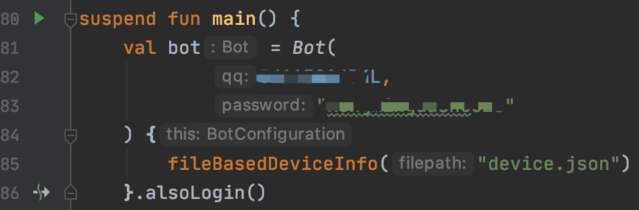
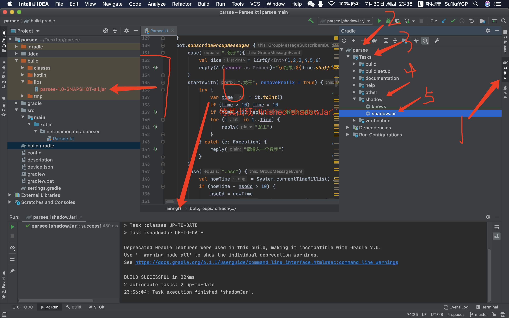
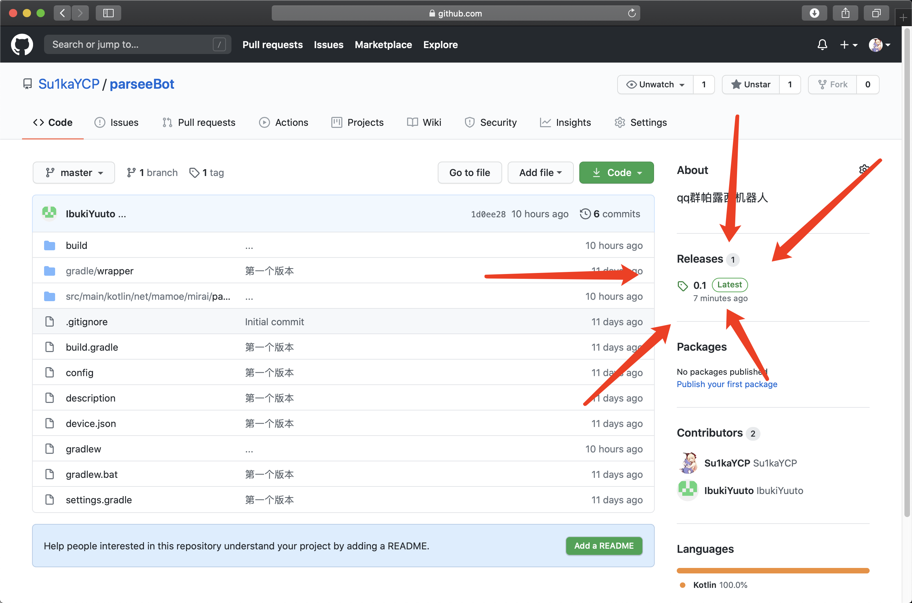

[](http://175.24.40.13)Su1kaYCP

# 帕露西机器人

## 一.通过编译源码部署

### 1.下载源码

在命令行中输入命令`git clone https://github.com/su1kaycp/parseebot`

### [2.增加gradle依赖](https://github.com/mamoe/mirai/blob/master/docs/guide_getting_started.md)

- 打开项目的`project`面板，点击编辑`build.gradle`
- 首先增加repositories

```
//添加jcenter仓库
/*
repositories {
    maven { url 'https://dl.bintray.com/kotlin/kotlin-eap' }
    mavenCentral()
}
原文内容，更新为下文
*/

repositories {
    maven { url 'https://dl.bintray.com/kotlin/kotlin-eap' }
    mavenCentral()
    jcenter()
}
```

- 增加依赖，将dependencies部分覆盖

```
dependencies {
    implementation 'net.mamoe:mirai-core-qqandroid:1.1-EA'
    implementation "org.jetbrains.kotlin:kotlin-stdlib-jdk8"
    testCompile group: 'junit', name: 'junit', version: '4.12'
}
```

- 打开右侧`gradle面板`，点击`刷新`按钮
- 至此，依赖增加完成

### 3.设置bot号



`Bot(qq:Long;password:String)`

将自己的qq账号密码填入

- 注意:qq参数为`Long`类型，需在qq号后加`L`
- 例:Bot(123123123L,"123123123")

### [4.打jar包](https://github.com/mamoe/mirai/blob/master/docs/guide_build_for_mirai.md)

- 首先声明buildScript

```
buildscript {
    repositories {
        jcenter()
    }
    dependencies {
        classpath 'com.github.jengelman.gradle.plugins:shadow:5.2.0'
    }
}
```

- 在plugins中进行插件的使用

将原本的plugins

```
plugins {
    id 'java'
    id 'org.jetbrains.kotlin.jvm' version '1.3.61'
}
```

替换为

```
plugins {
    id 'java'
    id 'org.jetbrains.kotlin.jvm' version '1.3.61'
    id 'com.github.johnrengelman.shadow' version '5.2.0'//使用shadow对依赖进行打包
}

apply plugin: 'com.github.johnrengelman.shadow'
apply plugin: 'java'
```

- 增加shadowJar

在文件底部增加

```
shadowJar{
		// 生成包的命名规则： baseName-version-classifier.jar
    manifest {
        attributes(
                'Main-Class': 'net.mamoe.mirai.simpleloader.MyLoaderKt'//入口点
        )
    }
    // 将 build.gradle 打入到 jar 中, 方便查看依赖包版本
    from("./"){
        include 'build.gradle'
    }
}
```

#### 5. 按照图片步骤build



在build/libs/中找到生成的jar包

#### 6.执行

输入命令`java -jar <jar包名>`执行

## 二.通过release部署

### 1.下载[帕露西bot仓库](https://github.com/su1kaycp/parseebot)release中的jar包



### 2.执行

输入命令`java -jar <jar包名>`执行
